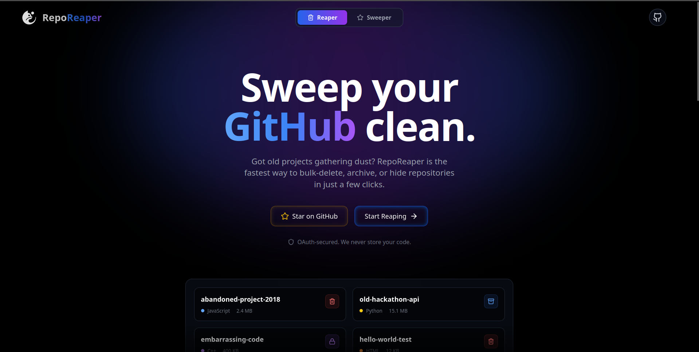
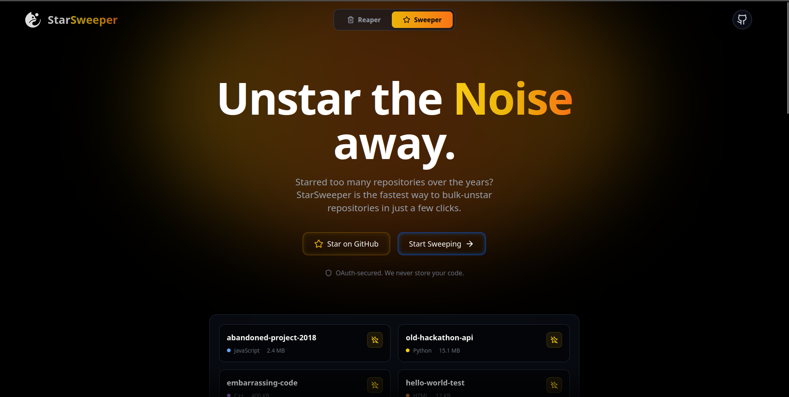

<div align="center">

# RepoReaper & StarSweeper ⚔️✨

[](https://opensource.org/licenses/ISC)
[](https://nodejs.org/)
[](https://docs.github.com/en/developers/apps/building-oauth-apps/creating-an-oauth-app)
[](https://reporeaper-frontend.onrender.com)

> Two powerful tools, one unified platform. Effortlessly clean up your GitHub repositories and starred lists. Fast. Secure. Stateless.

</div>

---

## 🌐 Live Site

🔗 [https://reporeaper-frontend.onrender.com](https://reporeaper-frontend.onrender.com)




## 🚀 Features

The platform operates in two dynamic modes, easily switchable via the global toggle in the navbar:

### ⚔️ RepoReaper Mode
- 🗑️ **Bulk Delete Repositories** — Wipe out multiple old, abandoned repositories in one click.
- 📦 **Safe Archiving** — Not ready to delete? Bulk archive your repositories to make them read-only.
- 🔒 **Privacy First** — Bulk-convert public repositories to private. Hide your embarrassing code without losing history.

### ✨ StarSweeper Mode
- ⭐ **Bulk Unstar** — Starred too many repositories over the years? Quickly bulk-unstar them to clean up your digital footprint.
- 🎨 **Dynamic Theming** — When in StarSweeper mode, the entire application seamlessly transforms its UI to a warm, yellow/orange theme.

### 🛡️ Platform Features
- 🔐 **Secure GitHub OAuth Login** — Fast and safe authentication.
- 🔍 **Smart Filters** — Filter your lists by name, size, or update date.
- 🚫 **Stateless Architecture** — We don't use a database. We never store your tokens, repositories, or code. Everything happens in-memory.
- 💎 **Modern UI** — Clean, responsive, glassmorphic frontend built for speed and usability.

---

## ⚙️ Tech Stack

- **Frontend:** React + Vite + TailwindCSS + Zustand + Framer Motion
- **Backend:** Node.js + Express  
- **Auth:** GitHub OAuth  
- **Deployment:** Render (Frontend + Backend hosted separately)

---

## 🧪 Local Setup

### 📦 Prerequisites

- Node.js v14 or higher  
- npm or yarn  
- GitHub OAuth App credentials

### 🔐 Environment Variables

Create a `.env` file in the `server` directory:

```env
PORT=3000
GITHUB_CLIENT_ID=your_github_client_id
GITHUB_REDIRECT_URI=github_redirect_url (e.g., http://localhost:3000/auth/github/callback)
GITHUB_CLIENT_SECRET=your_github_client_secret
SESSION_SECRET=your_session_secret
API_URL=http://localhost:3000
FRONTEND_URL=http://localhost:5173
```

Create a `.env` file in the `client` directory:

```env
VITE_FRONTEND_URL=http://localhost:5173
VITE_API_URL=http://localhost:3000
```

---

## 🛠️ Installation

1. Clone the repo  
   ```bash
   git clone https://github.com/kanak227/RepoReaper.git
   cd RepoReaper
   ```

2. Install frontend dependencies  
   ```bash
   cd client
   npm install
   ```

3. Install backend dependencies  
   ```bash
   cd ../server
   npm install
   ```

---

## 👨‍💻 Running the App Locally

### ▶️ Development Mode (Frontend + Backend separately)

Start the backend:
```bash
cd server
npm run dev
```

Start the frontend (in a new terminal):
```bash
cd client
npm run dev
```

Visit: [http://localhost:5173](http://localhost:5173)

---


## 🤝 Contributing

RepoReaper & StarSweeper is open to contributions! Whether you found a bug, have a feature request, or want to submit a pull request — you're welcome!

### How to contribute:

- 🐛 **Found a bug?**  
  [Open an issue](https://github.com/kanak227/RepoReaper/issues) with a clear description and reproduction steps.

- 🌟 **Want to improve a feature or UI?**  
  Fork the repo, create a new branch, and make a pull request.

- 📚 **Need help setting up?**  
  Open a discussion or issue — we’re happy to assist.

**💡 Tip:** Be sure to follow standard coding practices and write clean, commented code. It makes reviewing much easier!

---

## 🧯 Troubleshooting

### GitHub Auth not working?

- Ensure GitHub OAuth callback is exactly matching what you set in your `.env` (e.g., `http://localhost:3000/auth/github/callback`).
- Verify that all `.env` values are correctly set.

---
## 📄 License

This project is licensed under a [Non-Commercial License](LICENSE.md).  
For commercial inquiries, please contact 📧 kanakverma325@gmail.com.
