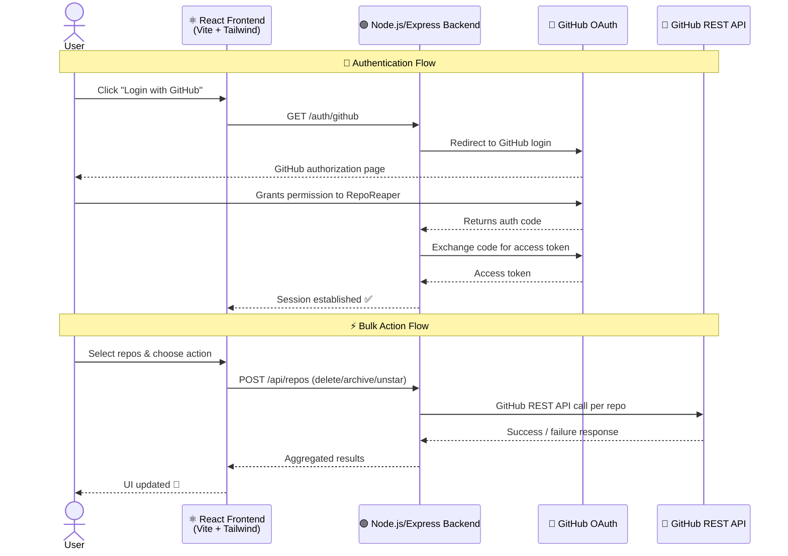

<div align="center">

# RepoReaper & StarSweeper ⚔️✨

[](https://opensource.org/licenses/MIT)
[](https://nodejs.org/)
[](https://docs.github.com/en/developers/apps/building-oauth-apps/creating-an-oauth-app)
[](https://reporeaper-frontend.onrender.com)
[](https://github.com/kanak227/RepoReaper/pulls)

> Two powerful tools, one unified platform to manage your GitHub repositories and starred repositories efficiently.

<p>
  <a href="https://reporeaper-frontend.onrender.com"><strong>🌐 Live Demo</strong></a> •
  <a href="https://github.com/kanak227/RepoReaper/issues"><strong>🐛 Report Bug</strong></a> •
  <a href="https://github.com/kanak227/RepoReaper/issues"><strong>✨ Request Feature</strong></a> •
  <a href="CONTRIBUTING.md"><strong>🤝 Contribute</strong></a>
</p>

</div>

---

## 📚 Table of Contents

- [📖 Overview](#overview)
- [🌐 Live Demo](#live-demo)
- [📸 Screenshots](#screenshots)
- [🏗️ System Architecture](#system-architecture)
- [🚀 Features](#features)
- [⚙️ Tech Stack](#tech-stack)
- [🧪 Local Setup](#local-setup)
- [🛠️ Installation](#installation)
- [▶️ Running the Application](#running-the-application)
- [🤝 Contributing](#contributing)
- [🧯 Troubleshooting](#troubleshooting)
- [📄 License](#license)
- [🙌 Acknowledgements](#acknowledgements)

---

## 📖 Overview

**RepoReaper & StarSweeper** is a full-stack GitHub productivity platform that helps developers clean up and organize their GitHub accounts — all in one place, with a simple and secure OAuth login.

| Tool | What it does |
|------|-------------|
| ⚔️ **RepoReaper** | Bulk delete, archive, and privatize your repositories |
| ✨ **StarSweeper** | Bulk unstar repositories to declutter your starred list |

**Why use it?**
- ✅ No manual repo-by-repo clicking — do it all at once
- 🔐 Secure GitHub OAuth — no passwords stored
- 🚫 Fully stateless — zero permanent storage of your data
- ⚡ Fast, modern UI built with React + Tailwind

---

## 🌐 Live Demo

Try it live — no installation needed:

🔗 **[https://reporeaper-frontend.onrender.com](https://reporeaper-frontend.onrender.com)**

> **Note:** The app is hosted on Render's free tier. It may take ~30 seconds to wake up on the first visit.

---

## 📸 Screenshots

**RepoReaper Dashboard — Bulk manage your repos**


**StarSweeper Mode — Clean up your starred list**


---

## 🏗️ System Architecture

The diagram below shows how the different parts of RepoReaper talk to each other — from login to bulk actions:



### How it works

| Layer | Role |
|-------|------|
| **React Frontend** | UI where users select repos and trigger bulk actions |
| **Express Backend** | Handles OAuth flow and proxies GitHub API calls |
| **GitHub OAuth** | Authenticates the user and issues a scoped access token |
| **GitHub REST API** | Executes the actual repo/star operations |

> **Stateless by design:** No user data, tokens, or repo information is ever stored in a database. Everything lives in the session and is discarded after use.

---

## 🚀 Features

### ⚔️ RepoReaper Mode

- 🗑️ **Bulk delete** repositories in one click
- 📦 **Bulk archive** repositories
- 🔒 **Bulk convert** repositories to private

### ✨ StarSweeper Mode

- ⭐ **Bulk unstar** repositories to declutter your GitHub profile
- 🎨 Dynamic yellow/orange theme to distinguish modes

### 🛡️ Platform Features

- 🔐 Secure GitHub OAuth authentication
- 🔍 Search, sorting, and filtering across all your repos
- ⚡ Fast bulk operations with real-time feedback
- 💎 Modern, responsive UI
- 🚫 Stateless backend — your data never touches a database

---

## ⚙️ Tech Stack

| Layer | Technologies |
|-------|-------------|
| **Frontend** | React, Vite, Tailwind CSS, Zustand, Framer Motion |
| **Backend** | Node.js, Express.js |
| **Authentication** | GitHub OAuth 2.0 |
| **Deployment** | Render |

---

## 🧪 Local Setup

### 📦 Prerequisites

Make sure you have the following installed before starting:

- [Node.js](https://nodejs.org/) v14 or higher
- npm or yarn
- A [GitHub OAuth App](https://docs.github.com/en/developers/apps/building-oauth-apps/creating-an-oauth-app) with credentials

### 🔑 Creating a GitHub OAuth App

1. Go to **GitHub → Settings → Developer Settings → OAuth Apps**
2. Click **"New OAuth App"**
3. Fill in the details:
   - **Homepage URL:** `http://localhost:5173`
   - **Authorization callback URL:** `http://localhost:3000/auth/github/callback`
4. Copy the **Client ID** and **Client Secret**

### 🔐 Environment Variables

#### Server (`server/.env`)

```env
PORT=3000
GITHUB_CLIENT_ID=your_github_client_id
GITHUB_CLIENT_SECRET=your_github_client_secret
GITHUB_REDIRECT_URI=http://localhost:3000/auth/github/callback
SESSION_SECRET=your_session_secret
API_URL=http://localhost:3000
FRONTEND_URL=http://localhost:5173
NODE_ENV=development
```

#### Client (`client/.env`)

```env
VITE_FRONTEND_URL=http://localhost:5173
VITE_API_URL=http://localhost:3000
```

---

## 🛠️ Installation

```bash
# 1. Clone the repository
git clone https://github.com/kanak227/RepoReaper.git
cd RepoReaper

# 2. Install frontend dependencies
cd client
npm install

# 3. Install backend dependencies
cd ../server
npm install
```

---

## ▶️ Running the Application

### Start the Backend

```bash
cd server
npm run dev
```

### Start the Frontend

```bash
cd client
npm run dev
```

Open your browser at: **`http://localhost:5173`**

> Run both the frontend and backend simultaneously in separate terminals.

---

## 🤝 Contributing

Contributions are welcome from developers of all experience levels! 🎉

### Ways to Contribute

| Type | Description |
|------|-------------|
| 🐛 Bug Reports | Found something broken? Open an issue |
| ✨ New Features | Have an idea? We'd love to hear it |
| 🎨 UI/UX | Make the interface better |
| 📚 Documentation | Improve guides, README, or comments |
| 🧪 Tests | Add or improve test coverage |

### Getting Started

```bash
# 1. Fork the repo on GitHub, then clone your fork
git clone https://github.com/<your-username>/RepoReaper.git

# 2. Create a feature branch
git checkout -b feat/your-feature-name

# 3. Make your changes and commit
git commit -m "feat: describe your change"

# 4. Push and open a Pull Request
git push origin feat/your-feature-name
```

Please read before contributing:
- 📘 [CONTRIBUTING.md](CONTRIBUTING.md)
- 🤝 [CODE_OF_CONDUCT.md](CODE_OF_CONDUCT.md)

### 🌱 Good First Issues

New to open source? Start here:

- Issues labeled [`good first issue`](https://github.com/kanak227/RepoReaper/issues?q=label%3A%22good+first+issue%22)
- Issues labeled [`beginner friendly`](https://github.com/kanak227/RepoReaper/issues?q=label%3A%22beginner+friendly%22)
- Issues labeled [`gssoc26`](https://github.com/kanak227/RepoReaper/issues?q=label%3Agssoc26)

👉 [View all open issues](https://github.com/kanak227/RepoReaper/issues)

---

## 🧯 Troubleshooting

### GitHub OAuth Not Working

- Ensure the callback URL in your GitHub OAuth App **exactly matches** `GITHUB_REDIRECT_URI` in `server/.env`
- Verify all `.env` variables are set correctly (no extra spaces or quotes)
- Restart both the frontend and backend after updating environment variables

### App Not Loading

- Make sure both the frontend (`port 5173`) and backend (`port 3000`) are running simultaneously
- Check that `VITE_API_URL` in `client/.env` points to your running backend

### Render Cold Start

- The live demo is on Render's free tier — first load may take ~30 seconds to spin up

---

## 📄 License

This project is licensed under the [MIT License](LICENSE) — feel free to use, modify, and distribute.

---

## ⭐ Support

If you find this project useful, please consider **starring the repository** — it helps others discover it!

---

## 🙌 Acknowledgements

Built with ❤️ using React, Node.js, Express.js, and the GitHub API.
